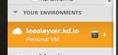
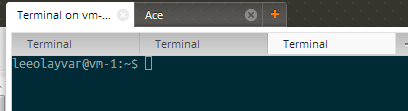

Finding your VM Number is a pretty easy task, but it is one that the majority
of Koding guides require. As such, this guide was created mostly to
avoid duplication, while still providing good instructions on how to actually
find your VM number.

So, lets get started!

## Video

*(Coming Soon)*

## Finding your VM Number

Your Terminal is one of the simplest, and most reliable ways to find your
VM number. As long as you haven't messed with bash, or are using a custom
shell, this method is solid and should work every time.

1. Go to [Koding/Develop][0] and in the lower left, under **Your
  Environments**, open the Terminal of the VM you are interested by selecting
  the little green and gray Terminal Button.
  
  
  
2. Once in your terminal, you will be presented with
  `username@vm-X:~$` where `vm-X` is your vm number! For example,
  `vm-0`, `vm-1`, etc.
  
  
  
  That's all you need! If something asks for your vm-Number, such as
  `username@<vm-Number>.username.koding.kd.io`, using the above information
  would translate into `username@vm-0.username.koding.kd.io`.

[0]: https://koding.com/Develop