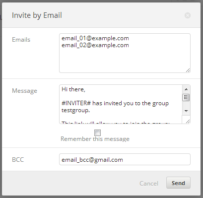
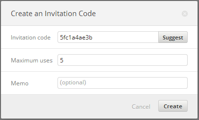

Koding Groups are a core feature of Koding, and allow for a lot of versatility
in group programming. It allows your development and team communication
to be in one area, and even sharing the same machines if you use Shared
VMs.

This guide will go over the concepts of Koding Groups, and how to manage
one.

## What are Groups?

Groups give you and your team a section of Koding to be productive. The
activity feed of your group can be public or private and you can even make
[Shared VMs](#shared-vms)!

They are being designed for large and small team collaboration, and have the
ability to support any number of users. Even the default Koding feed, is a
Group.

## Group Invitations

Since groups can be private, you have multiple avenues to invite team
members. The different ways you can invite are in place to support many
different types of teams. Lets go over each type of invitation real quick.

All invites can be found from from your Group Dashboard
`https://koding.com/<group-name>/Dashboard`. To find this, go to your
group, and on the left side select *"Group"*. You will then be directed to
your Dashboard. Select Invitations.

### Email

Invitation by email allows you to target any number of members by sending
them unique invites via email.

Enter in any number of emails, one on each line. You can also modify the
email contents that are sent to each of the emails. Make sure to include
the `#URL#` variable! This allows them to actually join with the
invitation link.

After you are satisfied with the email and recipients, click send. An example
image is below

### Invite Codes

Invite codes can be a link, or a code entered upon visiting the group. They
have a customizable limit on how many times a code can be redeemed as well.

To create a code, simply go to the *"Invitation Codes"* tab, and press the
*"Create Invitation Code"* button. You can now use the generated code or
make your own, as well as explicitly define how many times this code can
be redeemed. An example image is below.

### Invitation Requests

Lastly, if you have your Group set up, users can simply request access.
You can then approve requesters one by one, or in bulk.

Any users who have requested access will show up here. You can approve them
or deny them, and if you click *"Bulk Approve"* in the upper right, you
can approve as many users as you want at once. Note that for users to
request access, your [Privacy Options](#privacy-options) must be set
to Public.

## Group Settings

Group Settings offer basic customization of a group. You can modify a groups
name, description, readme, and listed & visibility settings.

### Privacy Options

Privacy has two options, Public and Private. This setting just controls
a users ability to request an invite. Nothing more.

So, if Privacy is set to `Public`, users can join themselves by pressing
*"Join"*. If set to `Private`, users must request access by pressing the
*"Request Access"* button.

**Note:** A Privacy setting of `Private` does not mean a random guest/member
cannot view your Group. If you want to make your group unlisted and
content invisible see the [visiblity](#visibility-options) and
[CActivity](#cactivity) options below.

### Visibility Options

Visiblity controls whether or not your Group will be listed in the main
Group List and if content posted to your Group will also show up in the
main Koding Feed.

A setting of `visible` means that your group *will* show up in the group list
and all content posted to your group will stream into the main Koding Feed.

A setting of `hidden` means that your group will *not* show up in the
Group List and content will not show up in the Koding Feed.

## Group Permissions

Group permissions are quite extensive and configurable. So configurable,
that we can't go over every single setting. What we will go over, is how
it is all structured and what each group means.

### Roles

Roles are given a set of permissions, such as read activity and read posts,
and assigned to users of your Group. Allowing you to control what users with
that role are able to do. Groups come with four roles by default, and can
have additional roles added.

~~To add a Role, go to your Group Dashboard and select the Permissions menu
item. From there, look in the bottom and select the **"Add Role"** button.
From there, you can define the Role Name, as well as importing a set of
permissions that the role will have to start with.~~

**IMPORTANT:** There is currently a bug with adding roles.
**DO NOT ADD ROLES**. I will remove this when i am aware of the bug being
fixed, but for the time being it is best to not add additional roles. The
default roles work perfectly fine. ~lee

### Permission Categories

The permissions are arranged in categories for ease of navigation. They
also include quite a few not-implemented permissions as well. With this
said, we will just go over a few of the more notable permissions in this
guide. Please see [the wiki][1]'s permissions table for detailed
information of these. In the future, when more are of the permission
features are implemented we will likely go over them here, with a video.

- **CActivity -> Read Activity**
  
  This controls which roles are able to read your activity feed. Note that
  this is independant of the Read Posts permission.

## Shared VMs

Shared VMs are similar to Personal VMs, except that multiple users are on the
same VM. Usage and resources are shared, but locations are not by default.

### Filesystem

The filesystem is a point of confusion for a lot of users. They
expect two users to have the same home directory by default, which is not
the case. It is the same machine, but not the same home/user directories.

For the sake of this explanation, lets say we have two users. `john` and
`henry`, with a Shared VM of `shared-0.ourgroup.kd.io`.
In the filesystem, Johns home directory is located at `/home/john`
and Henrys is located at `/home/henry`. The actual `ourgroup` VM is located
at `/home/ourgroup`.

This seems pretty straight forward, but then the next common question is
how can i connect to my Shared VM `~/Web` directory? In a shared VM, 
`~/Web` directories are linked to `/home/<groupname>/Web/~<username>/`.

So, in practice the connection addresses look like this:

- `http://shared-0.ourgroup.kd.io` = `/home/ourgroup/Web`
- `http://shared-0.ourgroup.kd.io/~john` = `/home/john/Web`
- `http://shared-0.ourgroup.kd.io/~henry` = `/home/henry/Web`

[0]: https://github.com/koding/docs/wiki
[1]: https://github.com/koding/docs/wiki/Group-Permissions
