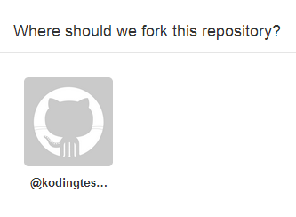
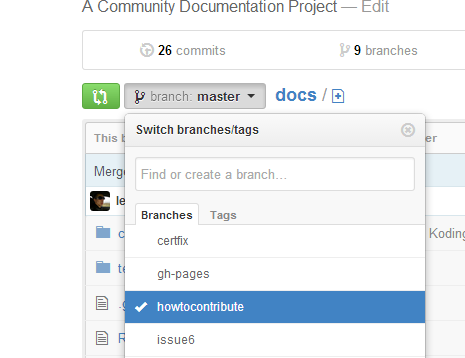
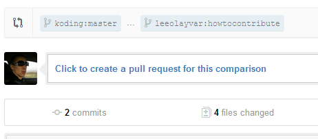

In this guide, we will get a bit meta and talk about how to write guides.
We'll cover the *"Mission Statement"* and the basic process of how to
Fork, Commit, and make a Pull Request on the official Koding Docs repo. Basic
understanding of Git is required, but if there is any confusion on the
Pull Request process hopefully this Guide will help you overcome that.
Beware, this is a long guide, as we cover a lot of general details.

So, lets get started!


<a name="mission" class="anchor"></a>
## Mission Statement

While the [Koding Docs Wiki][4] is great for general and quickly evolving
data, things can get messy. Keeping guides consistent and stable can be
difficult, as none of the Wiki is really "controlled". Consistency
has to be enforced by reverting bad changes, rather than attempting to always
add positive changes. So, these guides focus on that one aspect that
the Wiki fails at.

The Guides should be guides only. The general rule of thumb would be:
If i make a video to be paired with the Guide, would you want to watch it?
If you submit a table of Keyboard Shortcuts, would you *(or anyone for that
matter)* want to sit and listen to a person list them off in video form?
Probably not. Tutorial guides make sense for ordered instructions, or
something very error prone, but not so much for simple factual data.
Put that on [the Wiki][4].

Lastly, Guides need to relate to Koding somehow. If the issue(s) trying
to be resolved in the guide do not relate to Koding, why is it in these docs?
If you have a wordpress setting that you are confused about, go lookup
the Wordpress documentation. Now, if you have a problem installing wordpress
due to Kodings pre-configured Apache settings, then maybe a guide would
fit quite well on the Koding Docs. Make sense?

We don't mean to come off as controlling, and we would really love your
contribution to these Docs, but control is the core of what separates
the Guides from the Wiki and it is how we expect to preserve quality. :)


<a name="whatyouwillneed" class="anchor"></a>
## What you will need

### Knowledge

Knowledge of a topic to the extent that you are able to write a clear and
understandable tutorial on it. If applicable, you can even make a video for
it, but otherwise I *(Lee Olayvar)* will do my best to make videos for
all Guides.

### Markdown

Knowledge of the [Markdown Syntax][1]. The guides are all written in
Markdown, and are compiled to HTML with the [Wintersmith][2] project.

### Optional: Wintersmith

The actual site you see [here][0] is a static site compiled by
[Wintersmith][2]. You won't need to compile or anything, but you can install
it if you like. An installation of Wintersmith would allow you to preview
the rendered Markdown as you write, helping ensure formatting is as you expect.
Again, this is entirely optional. As long as your markdown is valid, you don't
need Wintersmith. For instructions on how to install & run Wintersmith,
[see below](#wintersmithinstallation).


<a name="forking" class="anchor"></a>
## Editing

Within the project files you will see a folder called `contents`. This
contains markdown and json documents, mostly markdown, that are compiled
into HTML.

To describe how to edit the docs, or to add your own guide, we will go
over each scenario. Editing is pretty simple, so i'll try to be brief.

### Editing an existing document

Pretend you see a typo on the website, how do you find that file in the
Docs source?

Everything in the main site is relative to the `contents/` source folder. So,
`http://koding.github.io/docs/index.html` is `contents/index.md`. Documents
within folders, are also relative. So
`http://koding.github.io/docs/guides/setting-up-ftp/index.html` can be
found at `contents/guides/setting-up-ftp/index.md`. Note how everything after
`docs/` from the website, and `contents/` in the source folder, are the same!


### Creating new documents

So, if we wanted to create a document under
`http://koding.github.io/docs/guides/my-guide/`, we would create a folder
called `contents/guides/my-guide` and put a file in the folder called 
`index.md`. Everything in that markdown file would now be rendered to
`http://koding.github.io/docs/guides/my-guide/index.html`, simple eh?

Images can also be placed in that folder, allowing you to have
images in your guide. Same goes for additional markdown pages! You can do
pretty much anything you need to do :)


### Consistency

Consistency is very important for these guides. So, look for patterns, and
follow them. Don't put a new guide of yours at `contents/my-guide.md` because
all of the other guides are found within `contents/guides/some-guide/index.md`.

Doing things consistently and correctly are the only ways to get your
content submitted to the official site, so *please*, if you are unsure of
something [ask questions][3]!


<a name="forking" class="anchor"></a>
## Forking, Cloning, Committing, and Pull Requesting

This is a rather elementary section of the tutorial. If you know Git,
please ignore this. If you only basically understand Git, this tutorial
may help you.

This general process will be pretty easy, but a few things are required on
your own part. You must have an SSH Public Key for your VM added to GitHub. If
you do not, and you need help doing this, please see
[this tutorial](https://help.github.com/articles/generating-ssh-keys#platform-linux)
on generating your SSH Key, and adding it to Github. Note that Step 3,
you can simply open the file `~/.ssh/id_rsa.pub` in the Koding Ace
editor and copy the contents manually. No need for xclip :)

If you're already familiar with Git, and have all that step, readon.

1. Fork the [Koding/docs][0] repo by going to
  [this url](https://github.com/koding/docs/fork) and select the little
  square with your name. This will fork the Koding repo.
  
  
2. Next, we open up our Terminal and clone our forked repository! To do this,
  type the following command, replace `<githubuser>` with your Github username.
  
  ```
  git clone git@github.com:<githubuser>/docs.git
  ```
  
3. Now you should have a directory called `docs` wherever you ran that
  command. This is your local cloned repository, of your forked repo.
  cd into the directory with `cd docs`  
  
4. Create a new branch, titled with a short few-word description of your
  guide title, with `git checkout -b my-guide-name`.
  
5. Now to do the actual writing! If you need help figuring out what to edit,
  see the [above step](#editing) on that subject.
  
6. Lets pretend you are done editing, you have previewed your Guide with
  Wintersmith and your guide is great! Now you want to commit your code
  to your local repo with `git add .` and `git commit`. After typing
  git commit, you will be presented with a terminal text editor, likely
  Nano or Vim. Type in a commit message, and save the message.
  
7. Now, you'll push your custom branch to your forked repo. This can be
  done with `git push -u origin my-guide-name`, where `my-guide-name` is the
  name of the branch that you checked out earlier. If you have an SSH password
  *(and you should)*, you'll have to enter it after this command. Enter it
  and proceed to the next step.
  
8. We're done with the Terminal stuff! Now visit your fork on
  Github, located at `https://github.com/<githubuser>/docs`, and click
  on the branch icon. Then select your branch from the dropdown list.
  After that, click the little green button next to your selected branch.
  
  
  
  This will compare your branch, to the master Koding/docs branch.
  
9. Last Step! From here, you simply click on *"create a pull request for
  this comparison"*.
  
  
  
  Enter in a Title and comment, both describing what your branch is about
  and the instructions you provide. Then click *"Send pull request"*!
  
  You're done! Now there is a pull request, on the official repo, that
  will be reviewed by a core Koding/docs contributor. They may reply with
  additional notes that you should add to your branch if you formatted
  something incorrectly, or ask you to remove some modifications from your
  pull request, etc. It's a place for discussion, about the code you are
  adding to the official repo, so it's quite important. Expect critiques!
  
  Once everything looks good, and assuming your edits match the Mission
  Statement, they will be merged in, and be on the [official site][0] within
  a couple days!
  
  **Note:** Explaining Git to non-Git people can be a bit confusing, so
  *please* feel free to [comment][3] on this guide if you don't understand
  something. This specific section will likely need much iteration! Thanks!

  

<a name="wintersmithinstallation" class="anchor"></a>
## Winstersmith Installation and Preview

### Installation

1. Type `sudo npm install -g wintersmith`

2. You're done!

### Usage

Wintersmith can be used to preview your project as you type in guides.

1. To start, open a terminal which will run the Wintersmith process. If
  you need access to the terminal while running Wintersmith, you can close it
  or simply open a second terminal.

2. Start wintersmith with `wintersmith preview`.

3. Wintersmith is now running on your VM, and you can preview it by going to
  `http://<vm-Number>.<username>.kd.io:8080/docs/`. Note, that Wintersmith's
  preview web server can be a bit picky. It requires the ending `/`.

4. Now simply make edits, and refresh the Wintersmith page to see them
  rendered! Easy eh? :)  


[0]: http://koding.github.io/docs/
[1]: http://daringfireball.net/projects/markdown/
[2]: https://github.com/jnordberg/wintersmith
[3]: https://github.com/koding/docs/issues/new
[4]: https://github.com/koding/docs/wiki

