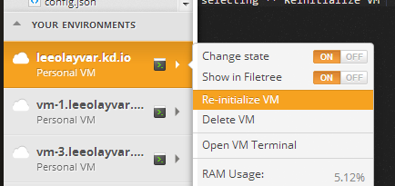

This guide will go over what reinitializing is, and the ramifications and
advantages of using the feature. It's a good feature to know, and
understanding it will help you make decisions to make the best use of Koding
as possible. So, lets get started!


## What Is Reinitializing?

When you reinitialize a VM you reset it to "factory defaults", as it were.
It resets **everything** outside of your `/home` directory. This
includes removing, for example, mysql databases, phpmyadmin, installed
apt-get libraries, everything.

What does this do for you? Well, it's similar to wiping and reinstalling
a computers OS. You lose all of the installed programs, but you also fix any
odd behavior that may have been occuring on the OS. The computer might have
had broken libraries installed, bad programs, etc. By wiping everything,
you can easily start over, rather than trying to "fix" it all.
Reinitializing lets you do this, without losing any of your `/home` &
`/home/username` files!

Reinitializing is a powerful tool, and it's so freely and cheaply available
that it can be used to "fix things" quite easily.


## Reinitializing Experiment

For the sake of understanding what really happens, lets create a few files.
To do this, run the following command:

```
sudo touch ~/userdir.txt /home/homedir.txt /rootdir.txt
```

This created three files. One in the userdir called `userdir.txt`, one in
the home directory called `homedir.txt`, and one in the root directory
called `rootdir.txt`.

Now, reinitialize by clicking on your VM under **"Your Environments"** and
selecting **"Re-initialize VM"**. See the image below as reference.



Now lets look at what happened.

```
leeolayvar@vm-0:~$ ls -l /
total 41020
drwxr-xr-x   2 root   root        4096 Jul 29 20:04 bin
drwxr-xr-x   2 root   root        4096 Jul 29 20:03 boot
drwxr-xr-x   6 root   root        4096 Jul 31 17:57 dev
drwxr-xr-x  94 root   root        4096 Jul 31 17:57 etc
-rw-r--r--   1 root   root    41924052 Jul 29 20:06 go_1.1.1-godeb1_amd64.deb
drwxr-xr-x   3 root   root        4096 Jul 31 17:57 home
drwxr-xr-x  17 root   root        4096 Jul 29 20:03 lib
drwxr-xr-x   2 root   root        4096 Jul 29 20:01 lib64
drwxr-xr-x   2 root   root        4096 Jul 31 17:57 lost+found
drwxr-xr-x   2 root   root        4096 Jul 29 20:01 media
drwxr-xr-x   2 root   root        4096 Apr 19 09:03 mnt
drwxr-xr-x   2 root   root        4096 Jul 29 20:01 opt
dr-xr-xr-x 937 nobody nogroup        0 Jul 31 17:57 proc
-rw-r--r--   1 root   root        3113 Jul 25 02:18 PublicKey
drwx------   4 root   root        4096 Jul 29 20:04 root
drwxr-xr-x  13 root   root         440 Jul 31 17:57 run
drwxr-xr-x   2 root   root        4096 Jul 29 20:03 sbin
drwxr-xr-x   2 root   root        4096 Jun 11  2012 selinux
drwxr-xr-x   2 root   root        4096 Jul 29 20:01 srv
dr-xr-xr-x  13 nobody nogroup        0 Jul 31 17:57 sys
drwxrwxrwt   5 root   root        4096 Jul 31 17:57 tmp
drwxr-xr-x  10 root   root        4096 Jul 29 20:01 usr
drwxr-xr-x  14 root   root        4096 Jul 31 17:57 var
leeolayvar@vm-0:~$ ls -l /home
total 4
-rw-r--r--  1 root       root          0 Jul 31 17:56 homedir.txt
drwxr-xr-x 14 leeolayvar leeolayvar 4096 Jul 31 17:54 leeolayvar
leeolayvar@vm-0:~$ ls -l ~
total 20
drwxr-xr-x 8 leeolayvar leeolayvar 4096 Jul 27 05:34 Applications
drwxr-xr-x 2 leeolayvar leeolayvar 4096 Jun 18 22:37 Backup
drwxr-xr-x 3 leeolayvar leeolayvar 4096 Jul 13 04:08 Documents
drwxr-xr-x 3 leeolayvar leeolayvar 4096 Jul 29 05:37 projects
-rw-r--r-- 1 leeolayvar leeolayvar    0 Jul 31 17:56 userdir.txt
drwxr-xr-x 2 leeolayvar leeolayvar 4096 Jul 31 17:35 Web
leeolayvar@vm-0:~$  
```

You'll notice that the `rootdir.txt` file has been removed from the root
directory, while the homedir and userdir files have been left intact!

This is all there really is to reinitializing. It removes everything
outside of your home directory, and returns it to factory defaults.
Setting up your environments to use your local namespace will allow
you to reinitialize anytime you want, which is pretty cool. I encourage it.


## Are there any 'Gotchas'?

There are no real Gotchas, it works perfectly as expected. The only real
confusion, is that sometimes people forget where something is actually
installed.

For example, if you install MySQL from apt-get then by default it is
not saving the database in your user directory. This is one of the bigger
points that you should understand. Unless you have set MySQL to use a
user directory as the storage location, and you reinitialize, you *will*
destroy your database. Same goes for any non-userspace storage.

In the future we may go over changing default locations for MySQL, MongoDB,
etc. However, currently i feel this is a bit outside the scope of these
guides. Nevertheless, feel free to
[make an issue on it](https://github.com/koding/docs/issues/new) and
request that it is covered in these guides. If there is enough interest,
i will gladly include it :)

For now though, please see Additional Resources below for various guides
we will be adding.


## Additional Resources

- [How to change the MySQL data default directory](http://www.ubuntugeek.com/how-to-change-the-mysql-data-default-directory.html)

